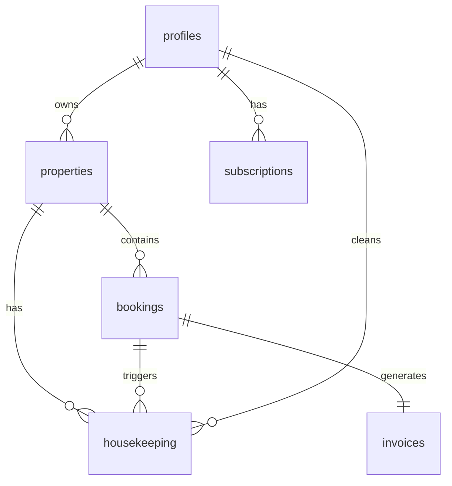

# 🏨 Villa Booking App

A comprehensive mobile application for managing hotel and villa bookings, built with React Native, Expo, and Supabase.


---

## 📋 Table of Contents

- [Overview](#-overview)
- [Features](#-features)
- [Tech Stack](#-tech-stack)
- [Prerequisites](#-prerequisites)
- [Installation](#-installation)
- [Environment Variables](#-environment-variables)
- [Project Structure](#-project-structure)
- [Database Schema](#-database-schema)
- [Running the App](#-running-the-app)
- [Authentication](#-authentication)
- [API Documentation](#-api-documentation)
- [Contributing](#-contributing)
- [License](#-license)

---

## 🌟 Overview

Villa Booking is a full-featured property management application designed for villa and hotel owners. It provides an intuitive interface for managing bookings, tracking housekeeping, generating invoices, and viewing comprehensive reports—all from your mobile device.

---

## ✨ Features

### 📅 **Calendar & Bookings**
- Interactive calendar view with color-coded bookings
- Create, edit, and delete guest reservations
- Track check-in/check-out dates
- Customer contact information management
- Payment status tracking

### 🏠 **Property Management**
- Manage multiple properties/villas
- Upload property images
- Property-specific booking views

### 🧹 **Housekeeping**
- Track cleaning status for each property
- Mark rooms as cleaned or pending
- Owner verification system
- Assign cleaners to specific tasks

### 📊 **Reports & Analytics**
- Revenue reports and statistics
- Occupancy tracking
- Booking trends analysis
- Export capabilities

### 🧾 **Invoicing**
- Auto-generate invoices for bookings
- Customizable invoice numbers
- PDF generation and sharing
- Invoice history and management

### 👤 **User Authentication**
- Secure email/password authentication
- Role-based access (Owner, Cleaner)
- Profile management
- Subscription tier support (Free, Monthly, Annual)

### ⚙️ **Settings**
- User profile customization
- Subscription management
- App preferences

---

## 🛠 Tech Stack

| Technology | Purpose |
|------------|---------|
| **React Native** | Cross-platform mobile framework |
| **Expo** | Development and build toolchain |
| **Expo Router** | File-based routing |
| **TypeScript** | Type-safe development |
| **Supabase** | Backend-as-a-Service (Auth, Database, Storage) |
| **NativeWind** | Tailwind CSS for React Native |
| **React Native Calendars** | Calendar UI component |
| **Expo Print** | PDF generation |
| **Expo Sharing** | File sharing capabilities |
| **Expo Notifications** | Push notifications |
| **Expo Image Picker** | Property image uploads |

---

## 📋 Prerequisites

Before you begin, ensure you have the following installed:

- [Node.js](https://nodejs.org/) (v18 or higher)
- [npm](https://www.npmjs.com/) or [yarn](https://yarnpkg.com/)
- [Expo CLI](https://docs.expo.dev/get-started/installation/)
- [Git](https://git-scm.com/)
- A [Supabase](https://supabase.com/) account (for backend)

For mobile testing:
- **iOS**: Xcode (Mac only) or Expo Go app
- **Android**: Android Studio or Expo Go app

---

## 🚀 Installation

1. **Clone the repository**
   ```bash
   git clone <repository-url>
   cd Villa
   ```

2. **Install dependencies**
   ```bash
   npm install
   ```

3. **Set up environment variables** (see [Environment Variables](#-environment-variables))

4. **Set up the database** (see [Database Schema](#-database-schema))

5. **Start the development server**
   ```bash
   npx expo start
   ```

---

## 🔐 Environment Variables

Create a `.env` file in the root directory with the following variables:

```env
EXPO_PUBLIC_SUPABASE_URL=https://tavwhriqtgqggycujwrq.supabase.co
EXPO_PUBLIC_SUPABASE_ANON_KEY=sb_publishable_o9EOOPxLnfOiwSk-6yhcqw_BcLqZWo1
```

### Variable Descriptions

| Variable | Description |
|----------|-------------|
| `EXPO_PUBLIC_SUPABASE_URL` | Your Supabase project URL |
| `EXPO_PUBLIC_SUPABASE_ANON_KEY` | Your Supabase anonymous/public key |

> **Note**: The `EXPO_PUBLIC_` prefix is required for Expo to expose these variables to the client-side code.

### Getting Your Supabase Credentials

1. Go to [Supabase Dashboard](https://app.supabase.com/)
2. Select your project (or create a new one)
3. Navigate to **Settings** → **API**
4. Copy the **Project URL** and **anon/public** key

---

## 📁 Project Structure

```
Villa/
├── app/                          # Expo Router pages
│   ├── (auth)/                   # Authentication screens
│   │   ├── _layout.tsx           # Auth layout
│   │   ├── index.tsx             # Auth entry point
│   │   ├── login.tsx             # Login screen
│   │   └── signup.tsx            # Sign up screen
│   ├── (tabs)/                   # Main app tabs
│   │   ├── _layout.tsx           # Tab navigation layout
│   │   ├── index.tsx             # Dashboard/Home
│   │   ├── calendar.tsx          # Calendar & bookings
│   │   ├── housekeeping.tsx      # Housekeeping management
│   │   ├── reports.tsx           # Reports & analytics
│   │   └── settings.tsx          # App settings
│   ├── booking/                  # Booking screens
│   ├── invoice/                  # Invoice screens
│   ├── property/                 # Property management
│   ├── _layout.tsx               # Root layout
│   └── index.tsx                 # App entry point
├── assets/                       # Images, icons, fonts
│   ├── icon.png
│   ├── splash-icon.png
│   ├── adaptive-icon.png
│   └── favicon.png
├── lib/                          # Utility libraries
│   ├── auth.tsx                  # Authentication context & hooks
│   └── supabase.ts               # Supabase client & types
├── .env                          # Environment variables
├── app.json                      # Expo configuration
├── global.css                    # Global styles
├── metro.config.js               # Metro bundler configuration
├── nativewind-env.d.ts           # NativeWind type definitions
├── package.json                  # Dependencies & scripts
├── supabase-schema.sql           # Database schema
├── tailwind.config.js            # Tailwind CSS configuration
└── tsconfig.json                 # TypeScript configuration
```

---

## 🗄 Database Schema

The app uses Supabase PostgreSQL as its database. Run the `supabase-schema.sql` file in your Supabase SQL Editor to set up the required tables.

### Tables Overview

| Table | Description |
|-------|-------------|
| `profiles` | User profiles extending auth.users |
| `properties` | Villas/rooms owned by users |
| `bookings` | Guest reservations |
| `housekeeping` | Cleaning status tracking |
| `invoices` | Generated invoices |
| `subscriptions` | User subscription plans |

### Entity Relationship Diagram



### Setting Up the Database

1. Go to your [Supabase Dashboard](https://app.supabase.com/)
2. Select your project
3. Navigate to **SQL Editor**
4. Copy the contents of `supabase-schema.sql`
5. Paste and run the SQL script
6. Verify tables are created in **Table Editor**

### Row Level Security (RLS)

The schema includes comprehensive RLS policies ensuring:
- Users can only view/edit their own data
- Properties are only accessible by their owners
- Bookings are scoped to property owners
- Housekeeping tasks respect property ownership

---

## 🏃 Running the App

### Development Mode

```bash
# Start the Expo development server
npx expo start

# Or use npm scripts
npm start
```

### Platform-Specific Commands

```bash
# iOS Simulator (Mac only)
npm run ios

# Android Emulator
npm run android

# Web Browser
npm run web
```

### Using Expo Go

1. Install **Expo Go** on your mobile device ([iOS](https://apps.apple.com/app/expo-go/id982107779) | [Android](https://play.google.com/store/apps/details?id=host.exp.exponent))
2. Run `npx expo start`
3. Scan the QR code with your camera (iOS) or Expo Go app (Android)

---

## 🔑 Authentication

The app uses Supabase Authentication with email/password credentials.

### Auth Flow

1. **Sign Up**: Users create an account with email, password, and full name
2. **Sign In**: Existing users authenticate with email/password
3. **Session Persistence**: Auth tokens are stored in AsyncStorage
4. **Auto Refresh**: Tokens are automatically refreshed

### User Roles

| Role | Permissions |
|------|-------------|
| **Owner** | Full access to all features, manage properties and bookings |
| **Cleaner** | Access to housekeeping tasks only |

### Subscription Tiers

| Tier | Features |
|------|----------|
| **Free** | Basic features, limited properties |
| **Monthly** | Full access, billed monthly |
| **Annual** | Full access, discounted annual billing |

---

## 📡 API Documentation

### Supabase Client

The Supabase client is configured in `lib/supabase.ts`:

```typescript
import { supabase } from './lib/supabase';

// Example: Fetch properties
const { data, error } = await supabase
  .from('properties')
  .select('*')
  .eq('owner_id', userId);
```

### Available Types

```typescript
import { Profile, Property, Booking, Housekeeping, Invoice } from './lib/supabase';
```

### Auth Context

```typescript
import { useAuth } from './lib/auth';

const { user, profile, signIn, signUp, signOut } = useAuth();
```

---

## 🧪 Testing

```bash
# Run TypeScript type checking
npx tsc --noEmit

# Check for ESLint issues (if configured)
npm run lint
```

---

## 📱 Building for Production

### Expo Application Services (EAS)

```bash
# Install EAS CLI
npm install -g eas-cli

# Configure EAS
eas build:configure

# Build for iOS
eas build --platform ios

# Build for Android
eas build --platform android
```

---

## 🤝 Contributing

1. Fork the repository
2. Create a feature branch (`git checkout -b feature/amazing-feature`)
3. Commit your changes (`git commit -m 'Add amazing feature'`)
4. Push to the branch (`git push origin feature/amazing-feature`)
5. Open a Pull Request

### Code Style Guidelines

- Use TypeScript for all new files
- Follow the existing code structure
- Use NativeWind/Tailwind for styling
- Keep components small and focused

---

## 📄 License

This project is licensed under the MIT License - see the [LICENSE](LICENSE) file for details.

---

## 🆘 Support

If you encounter any issues or have questions:

1. Check the [Issues](../../issues) page for existing solutions
2. Create a new issue with detailed information
3. Include steps to reproduce any bugs

---

## 🙏 Acknowledgments

- [Expo](https://expo.dev/) - Amazing React Native toolchain
- [Supabase](https://supabase.com/) - Open source Firebase alternative
- [NativeWind](https://www.nativewind.dev/) - Tailwind CSS for React Native
- [React Native Calendars](https://github.com/wix/react-native-calendars) - Calendar components

---

<div align="center">

**Made with ❤️ for Villa & Hotel Owners**

</div>
